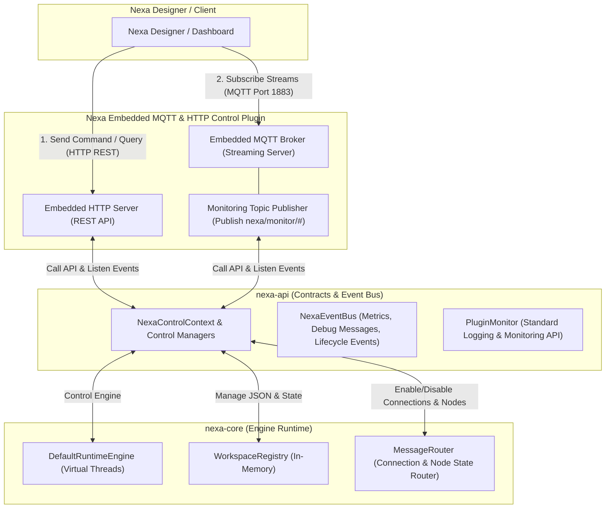

# Unified Architectural & Implementation Plan: Pluggable Control APIs and REST/MQTT Bridge

This document details both the architectural design and the concrete implementation plan to support complete control (Workspace, Node, Connection, and Runtime) and real-time streaming monitoring (Metrics, Logs, and Script Errors) in the Nexa Framework using a SOLID and pluggable architecture.

---

## 📌 Architectural Blueprint: "Control-by-API, Powered-by-Plugins"

All control and monitoring runtime capabilities are defined as **service contracts (SPI/API Interfaces)** inside the `nexa-api` module. The execution engine (`nexa-core`) implements these interfaces and exposes internal hooks. The protocol implementations (HTTP REST, MQTT, gRPC, etc.) are encapsulated entirely inside separate **Control Plugins** to preserve SOLID principles and prevent core bloating.



---

## 1. Specifications for Control & Monitoring APIs (`nexa-api`)

Here are the precise Java interface specifications to be added to the `nexa-api` module.

### 🎛️ A. Workspace Control (Manajemen Proyek & Skema)
Responsible for loading, unloading, enabling, disabling, and validating workspace configurations at runtime.

```java
package nexa.framework.runtime.api.control;

import java.util.List;

public interface WorkspaceControl {
    // Memuat workspace ke dalam memori sistem
    void loadWorkspace(String jsonSchema);
    
    // Menghapus workspace dari sistem secara permanen
    void unloadWorkspace(String workspaceId);
    
    // Mengaktifkan seluruh pemrosesan di dalam workspace
    void enableWorkspace(String workspaceId);
    
    // Menonaktifkan sementara seluruh pemrosesan di dalam workspace
    void disableWorkspace(String workspaceId);
    
    // Mengambil metadata/info seluruh workspace (tanpa data isi flow JSON-nya agar ringan)
    List<WorkspaceMetaInfo> getWorkspacesInfo();
    
    // Mengambil informasi detail workspace spesifik berdasarkan ID
    WorkspaceMetaInfo getWorkspaceInfo(String workspaceId);
    
    // Mengambil raw JSON data program dari workspace berdasarkan ID
    String getWorkspaceData(String workspaceId);
    
    // Melakukan pengecekan validitas skema JSON program sebelum di-load
    ValidationResult validateWorkspace(String jsonSchema);
    
    // Validasi sintaks script/DSL per node sebelum disimpan/dijalankan
    ScriptValidationResult validateNodeScript(String language, String script);
}
```

### 🧩 B. Node Control (Kontrol & Monitoring Node Individu)
Controls states of individual nodes (running vs blocked) and manages breakpoint step-by-step debugging.

```java
package nexa.framework.runtime.api.control;

import java.util.List;

public interface NodeControl {
    // Mengaktifkan node tertentu agar dapat memproses data
    void enableNode(String nodeId);
    
    // Menonaktifkan node tertentu (pesan ditahan/diabaikan saat masuk ke node ini)
    void disableNode(String nodeId);
    
    // Mendapatkan metadata dan informasi status runtime dari node spesifik
    NodeInfo getNodeInfo(String nodeId);
    
    // Mendapatkan history pesan masuk (incoming) dan keluar (outgoing) dari node
    NodeMessageHistory getNodeMessages(String nodeId);
    
    // Memasang breakpoint pada node tertentu untuk menahan eksekusi pesan
    void addBreakpoint(String nodeId);
    
    // Melepas breakpoint
    void removeBreakpoint(String nodeId);
    
    // Melanjutkan pemrosesan pesan yang tertahan di node
    void resumeNode(String nodeId);
    
    // Memproses hanya satu pesan berikutnya, lalu menahan kembali (step-by-step)
    void stepNode(String nodeId);
    
    // Mengambil payload pesan yang saat ini sedang tertahan di breakpoint
    RuntimeMessage getPausedMessage(String nodeId);
}
```

### 🔗 C. Connection Control (Kontrol & Debug Aliran Jalur Data)
Controls active states of connection data paths and supports manual message injection in the middle of flows.

```java
package nexa.framework.runtime.api.control;

public interface ConnectionControl {
    // Mengaktifkan jalur koneksi dari source node (data diperbolehkan mengalir)
    void enableConnection(String sourceNodeId);
    
    // Memutuskan/menonaktifkan sementara jalur koneksi dari source node (data diblokir)
    void disableConnection(String sourceNodeId);
    
    // Mendapatkan statistik & metadata dari jalur koneksi ini
    ConnectionInfo getConnectionInfo(String sourceNodeId);
    
    // Melakukan suntikan (injection) message di tengah-tengah jalur koneksi secara paksa
    void injectMessageIntoConnection(String sourceNodeId, RuntimeMessage message);
    
    // Menambah jalur koneksi data baru di runtime secara dinamis
    void addConnection(String sourceNodeId, String targetNodeId);
    
    // Menghapus jalur koneksi data di runtime secara dinamis
    void removeConnection(String sourceNodeId, String targetNodeId);
}
```

### ⚡ D. Runtime Control (Kontrol Lifecycle Global)
Controls global JVM execution and general environment parameters.

```java
package nexa.framework.runtime.api.control;

public interface RuntimeControl {
    // Menghentikan seluruh engine secara paksa (exit JVM)
    void shutdown();
    
    // Menghentikan pemrosesan engine secara aman (graceful stop)
    void stop();
    
    // Restart engine runtime secara bersih
    void restart();
    
    // Mendapatkan status kesehatan sistem global (CPU, memory, uptime, active threads)
    SystemStatus getSystemStatus();
    
    // Memindai ulang folder plugins dan memuat plugin baru secara dinamis
    void reloadPlugins();
    
    // Memicu JVM Garbage Collection (GC) secara programmatic
    void triggerGarbageCollection();
    
    // Membersihkan counter statistik pemrosesan data ke angka nol
    void resetWorkspaceMetrics(String workspaceId);
    void resetNodeMetrics(String nodeId);
}
```

### 📈 E. Runtime Monitoring & Metrics (Observabilitas Real-Time)
Provides structured interfaces to query performance status.

```java
package nexa.framework.runtime.api.control;

public interface RuntimeMonitoring {
    WorkspaceMetrics getWorkspaceRuntimeMetrics(String workspaceId);
    NodeMetrics getNodeMetrics(String nodeId);
    SystemMetrics getSystemRuntimeMetrics();
}
```

#### 🛠️ Plugin Lifecycle Monitoring (Standard API)
Enforces a standardized error/message feedback contract for all external plugins.

```java
package nexa.framework.runtime.api.plugin;

import java.util.List;

public interface PluginMonitor {
    void reportInfo(String pluginId, String message);
    void reportWarning(String pluginId, String message);
    void reportError(String pluginId, String message, Throwable throwable);
    List<PluginLogEvent> getPluginLogHistory(String pluginId);
}
```

---

## 2. API Endpoints & MQTT Streaming Topik

### 🌐 A. REST HTTP Endpoints (Client -> Nexa)
Used for Command execution and static querying (port `8080`).

| HTTP Method | Path | Deskripsi |
| :--- | :--- | :--- |
| **POST** | `/api/workspace/load` | Memuat workspace baru |
| **POST** | `/api/workspace/unload` | Menghapus workspace dari memori |
| **POST** | `/api/workspace/enable` | Mengaktifkan pemrosesan workspace |
| **POST** | `/api/workspace/disable` | Menonaktifkan pemrosesan workspace |
| **GET** | `/api/workspace/list` | Mendapatkan info list seluruh workspace |
| **GET** | `/api/workspace/:id` | Mendapatkan info lengkap workspace |
| **GET** | `/api/workspace/:id/data` | Mendapatkan raw JSON program workspace |
| **POST** | `/api/workspace/validate` | Validasi JSON schema workspace |
| **POST** | `/api/workspace/validate-script` | Validasi script per node sebelum deploy |
| **POST** | `/api/node/enable` | Mengaktifkan eksekusi node |
| **POST** | `/api/node/disable` | Menonaktifkan eksekusi node |
| **GET** | `/api/node/:id` | Mendapatkan info status runtime node |
| **POST** | `/api/node/breakpoint/add` | Memasang breakpoint |
| **POST** | `/api/node/breakpoint/remove` | Melepas breakpoint |
| **POST** | `/api/node/breakpoint/resume` | Resume execution pada breakpoint |
| **POST** | `/api/node/breakpoint/step` | Jalankan 1 step pada breakpoint |
| **GET** | `/api/node/breakpoint/message/:id` | Ambil payload ter-pause pada breakpoint |
| **POST** | `/api/connection/enable` | Mengaktifkan jalur koneksi |
| **POST** | `/api/connection/disable` | Menonaktifkan jalur koneksi |
| **POST** | `/api/connection/inject` | Menyuntikkan pesan ke jalur koneksi |
| **POST** | `/api/connection/add` | Menambah jalur koneksi dinamis |
| **POST** | `/api/connection/remove` | Menghapus jalur koneksi dinamis |
| **GET** | `/api/runtime/status` | Mendapatkan status CPU, RAM, Uptime |
| **POST** | `/api/runtime/shutdown` | Shutdown engine Nexa |
| **POST** | `/api/runtime/gc` | Trigger Garbage Collection manual |
| **POST** | `/api/runtime/reload-plugins` | Reload plugin secara dinamis |
| **POST** | `/api/runtime/metrics/reset/workspace` | Reset statistik workspace |
| **POST** | `/api/runtime/metrics/reset/node` | Reset statistik node |

### 📤 B. MQTT Streaming Topics (Nexa -> Client)
Used exclusively for event streaming to subscribers (port `1883`).

*   `nexa/monitor/system/status` -> Real-time status update (CPU, Memory, threads).
*   `nexa/monitor/workspace/metrics` -> Throughput rates & processing counters.
*   `nexa/monitor/node/messages` -> Debugging payload stream (visual tracer).
*   `nexa/monitor/node/errors` -> Detailed script compile/runtime failure telemetry (including `nodeId`, line numbers, error descriptions, and raw payloads).
*   `nexa/monitor/plugin/logs` -> Centralized warning/error tracking log from plugins.

---

## 3. Implementation Blueprint (Changes File-by-File)

### 1️⃣ Module: `nexa-api`

We will add the new SPI and control package.

#### [NEW] [Control Interfaces & DTO Classes](file:///d:/DEV/kufayeka/nexa-project/nexa-framework/nexa-api/src/main/java/nexa/framework/runtime/api/control/)
Contains:
*   `WorkspaceControl.java`, `NodeControl.java`, `ConnectionControl.java`, `RuntimeControl.java`, `RuntimeMonitoring.java`, `PluginMonitor.java`
*   DTO model files: `WorkspaceMetaInfo.java`, `NodeInfo.java`, `NodeMessageHistory.java`, `ConnectionInfo.java`, `SystemStatus.java`, `ValidationResult.java`, `ScriptValidationResult.java`.

---

### 2️⃣ Module: `nexa-core`

We will implement core engine logic to honor these control API commands and generate metrics/monitoring events.

#### [MODIFY] [`DefaultRuntimeEngine.java`](file:///d:/DEV/kufayeka/nexa-project/nexa-framework/nexa-core/src/main/java/nexa/framework/runtime/domain/execution/service/DefaultRuntimeEngine.java)
*   **Node States & Disabled Nodes**: Modify execution pipeline. If a target node is disabled, skip execution or swallow the packet.
*   **Breakpoint Debugger Engine**: Inside execution flow processing, check if breakpoint is active. If active:
    *   Store message in `pausedMessagesMap`.
    *   Obtain lock (`ReentrantLock` / `Condition`).
    *   Block thread execution (`condition.await()`) until `resumeNode()` or `stepNode()` is called by `NodeControl`.
*   **Script Failures Catching**: Wrap execution in try-catch. If a scripting exception occurs:
    *   Extract line number, message, and target payload.
    *   Fire `ScriptNodeFailureEvent` to the internal `NexaEventBus`.

#### [MODIFY] [`MessageRouter.java`](file:///d:/DEV/kufayeka/nexa-project/nexa-framework/nexa-core/src/main/java/nexa/framework/runtime/domain/routing/MessageRouter.java)
*   **Connection States**: Maintain a runtime connection state map (`activeConnections`). If a connection is disabled, block routing between source and destination.
*   **Dynamic Routes**: Add methods `addConnection(source, target)` and `removeConnection(source, target)` modifying routing configuration in memory.

---

### 3️⃣ Module: `nexa-control-plugin` (New Plugin Module)

#### [NEW] [Control Plugin Project Structure](file:///d:/DEV/kufayeka/nexa-project/nexa-framework/nexa-control-plugin/)
*   `build.gradle.kts`: Declares compile dependencies on Javalin HTTP (version `6.x.x` or similar Netty-based server) and Moquette Embedded MQTT Broker (version `0.15` or similar).
*   `NexaControlPlugin.java`: Implements `NexaPlugin`. On `onStart()`, boots:
    *   Javalin HTTP on port `8080`.
    *   Embedded Moquette Broker on port `1883`.
*   Hooks REST paths to core API instances.
*   Pipes events from `NexaEventBus` to the MQTT broker topics.

---

## 4. Verification & Testing Plan

### Automated Verification
*   Compile: `./gradlew.bat shadowJar`
*   Test: `./gradlew.bat test`

### Manual Verification
1.  **Launch standalone app** with the control plugin loaded.
2.  **Verify HTTP REST Endpoint**: Disable a node (`POST /api/node/disable`). Verify processing pauses.
3.  **Verify MQTT Streaming**: Sub to `nexa/monitor/node/errors` via MQTTX. Inject an invalid payload causing DSL compilation/runtime failure. Verify detailed crash telemetry is received.
4.  **Verify Breakpoint step execution**: Add a breakpoint, verify thread pauses, query payload, resume, and watch metrics increment.
