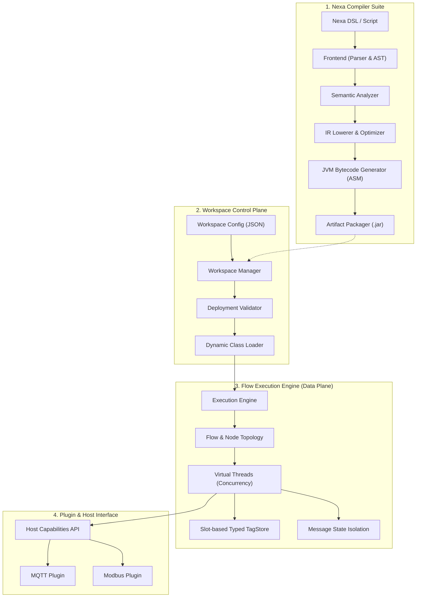
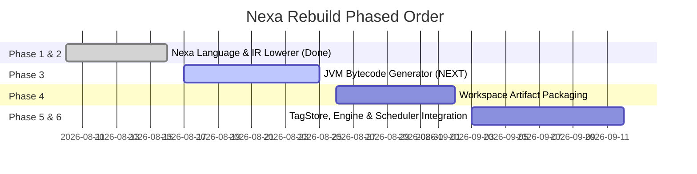

# Nexa Compiled Runtime Rebuild Roadmap 🚀

This document defines the architecture, boundary separation, and phased roadmap to transform Nexa from an interpreted, AST-evaluated flow runtime into a **compiled, low-latency industrial automation runtime** that executes native JVM bytecode.

---

## 🏗️ 1. Decoupled System Architecture

To ensure strict separation of concerns, the Nexa framework is divided into four completely decoupled subsystems. No module has direct implementation dependencies on other hot-path or control-plane components; communication is strictly through APIs and SPI boundaries.

### 1.1 Workspace Control Plane (Control Plane)
* **Responsibility**: Manages workspace lifecycle, deployments, validation, configuration storage, and administrative control.
* **Decoupling**: Has no direct execution code. It communicates with the data plane via dynamic class loading and configuration swaps. It ensures that a failed compilation never affects a running system.

### 1.2 Flow Execution Engine (Data Plane / Hot Path)
* **Responsibility**: Orchestrates the hot data path. Executes nodes, manages message propagation, runs concurrent tasks via virtual threads, and isolates state across message paths.
* **Decoupling**: Knows nothing about source code, lexers, or parsers. It only runs compiled JVM class instances representing the nodes. It accesses tag values via slot offsets in the memory-optimized `TypedTagStore`.

### 1.3 Nexa Compiler Suite (AOT Compiler)
* **Responsibility**: Translates source code, schemas, and configurations into optimized execution representation (JVM Bytecode).
* **Decoupling**: A standalone module that runs out-of-process or in a separate compilation sandbox. It is entirely stateless, consuming a `CompilationRequest` and yielding a `CompilationResult` (containing `.class` bytes and metadata).

### 1.4 Plugin & Host Interface (Plugin Subsystem)
* **Responsibility**: Provides access to third-party protocols (Modbus, MQTT) and system resources (Database pools, filesystem).
* **Decoupling**: Plugins interact with the execution data plane strictly through abstract **Host Capabilities** and registered schemas. The core engine never links to concrete plugin implementations.

---

## 🎯 2. Execution Strategy: What to Build First?

To achieve true compiled performance, we must execute our milestones in a precise order:

> [!IMPORTANT]
> **Immediate Action Item**: We must build **Phase 3 (JVM Bytecode Compiler)** next. We have the Frontend and the IR ready. Building the Bytecode Generator will allow us to convert optimized Nexa IR blocks directly to `.class` byte arrays, completely removing the AST interpreter from the hot path.

---

## 🚀 3. Phased Implementation Roadmap

### Phase 1: Nexa Language Frontend (COMPLETED)
- Lexer, Parser, AST, and strict Type System (primitives, structural types, dynamic `OBJECT` escape hatch).
- Semantic verification of assignments, variables, boundaries, and constant/narrowing conversions (both integers and decimals).

### Phase 2: Lowering to Nexa IR (COMPLETED)
- Stable translation boundary between high-level language AST and low-level code generator.
- SSA-like IR containing typed instructions (loads, stores, arithmetic, condition branches, call hooks).
- Static IR optimization pass and verification constraints.

### Phase 3: JVM Bytecode Compiler (ACTIVE NEXT STEP)
- Integrate **ASM** library to dynamically write Java bytecode.
- Translate Nexa IR instruction blocks to exact JVM bytecode instructions (e.g., mapping Nexa `INT32` to JVM `IADD`/`ISUB`, Nexa `FLOAT64` to `DADD`, etc.).
- Prevent boxing/unboxing overhead for primitive calculations on hot execution paths.
- Generate standalone class files representing compiled Nexa logic.

### Phase 4: Workspace Artifact Packager
- Package compiled classes and deployment metadata into an immutable `.jar` file.
- Define a secure, read-only class loader to spin up compiled scripts at runtime.
- Design the deployment validation interface (`gcloud`-like validation before hot-swap).

### Phase 5: Slot-Based TagStore & Dependency Engine (PARTIALLY COMPLETED)
- Refactor variable/tag access to use memory slot offsets instead of dynamic map lookup keys.
- Tag propagation logic in `TagDependencyEngine` to execute only downstream paths affected by a tag write, eliminating full topology scans.

### Phase 6: Thread-Isolated Concurrency Scheduler
- Allocate Virtual Threads dynamically per incoming execution trigger.
- Implement deep clone / copy-on-write isolation for messages moving down parallel path forks.
- Distinguish between deterministic high-speed calculation lanes and non-blocking background task lanes.

### Phase 7: Plugin Boundary & Host Capabilities API
- Expose stable signature declarations for external capabilities (MQTT publish, Modbus write).
- Compile plugin-calls into direct invoke virtual/interface JVM bytecode instructions.

### Phase 8: Benchmarks, JIT Warmup, and Optimization
- Benchmark with 10k/50k concurrent tags and 20ms schedules.
- Profile garbage collection, allocation rates, and boxing overhead on JVM HotSpot.
- Warm up compilation classloaders to prevent JIT lag.
