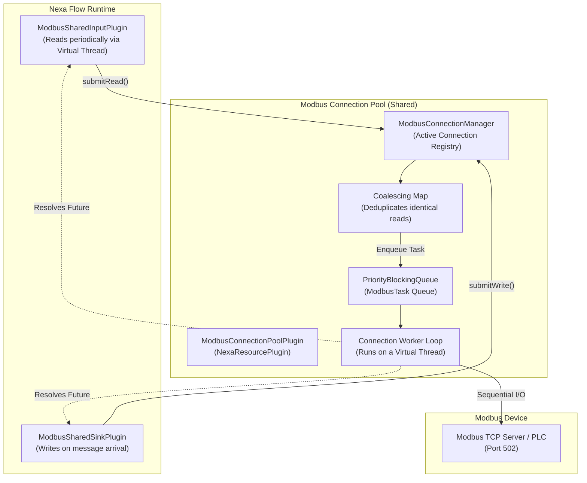

# 🔌 Nexa Modbus TCP Plugin

Plugin ini merupakan modul ekstensi untuk **Nexa Framework** yang memungkinkan komunikasi dua arah (Read & Write) secara berkecepatan tinggi dengan perangkat industri (seperti PLC, Sensor, Remote I/O, atau Gateway Modbus) melalui protokol **Modbus TCP**.

Plugin dirancang khusus untuk berjalan di atas JVM **Java 25** dan dioptimalkan untuk thread ringan (**Virtual Threads**), menjaga Carrier Thread sistem tetap terisolasi serta bebas dari masalah *thread-pinning*.

---

## 🚀 Fitur Utama

1. **Dukungan Lengkap Modbus Function Codes (FC):**
   *   **Pembacaan (Read):**
       *   `FC1` - Read Coils (Discrete Output)
       *   `FC2` - Read Discrete Inputs
       *   `FC3` - Read Holding Registers
       *   `FC4` - Read Input Registers
   *   **Penulisan (Write):**
       *   `FC5` - Write Single Coil
       *   `FC6` - Write Single Register
       *   `FC15` - Write Multiple Coils
       *   `FC16` - Write Multiple Registers

2. **Dukungan Berbagai Tipe Data & Konversi Otomatis:**
   *   `BOOLEAN` / `COIL` (1 bit)
   *   `INT16` / `UINT16` (1 register / 16-bit)
   *   `INT32` / `UINT32` / `FLOAT32` (2 register / 32-bit)
   *   `INT64` / `UINT64` / `FLOAT64` (4 register / 64-bit)
   *   `STRING` (ASCII, dengan panjang register yang dapat diatur)
   *   `RAW_INT` (list raw integer 16-bit)
   *   `RAW_HEX` (string hexadecimal dari representasi byte)

3. **Modus Swapping Byte & Word (Endianness):**
   *   `ABCD` - Big Endian (Standard)
   *   `BADC` - Byte Swap
   *   `CDAB` - Word Swap (Mid-Little Endian)
   *   `DCBA` - Little Endian (Double Swap)

4. **Sistem Pengaturan Alur Antrean (Flow Control):**
   *   **Priority Queuing:** Memisahkan prioritas eksekusi task. Tipe `WRITE` dapat dikonfigurasi untuk memotong antrean pembacaan (`HIGH` priority mode) untuk respons kontrol seketika.
   *   **Read Queue Sorting:** Antrean pembacaan secara otomatis diurutkan berdasarkan Slave Unit ID kemudian Register Address untuk mengurangi pergeseran head pembacaan PLC secara acak.
   *   **Read Request Coalescing:** Mencegah redundansi pembacaan dengan menggabungkan instruksi pembacaan parameter yang sama jika dipicu bersamaan sebelum tugas pertama selesai.
   *   **Fast-Fail Queue Flush:** Semua antrean yang menumpuk saat terputus langsung dibatalkan, mencegah thread terblokir menunggu *timeout*.
   *   **Auto Reconnection:** Latar belakang thread mendeteksi status putusnya soket TCP dan melakukan pemulihan secara periodik.

---

## ⚙️ Sistem Kerja Kode (Internal Mechanics)

Modbus TCP bekerja di atas soket jaringan sekuensial (Request-Response). Sistem antrean kita diatur oleh kelas-kelas berikut:



### 1. Antrean & Prioritas (`ModbusConnectionManager`)
*   Setiap `ModbusConnection` memiliki satu thread pekerja virtual (`Connection Worker Loop`) dan sebuah `PriorityBlockingQueue`.
*   Node input/output memanggil `submitRead()` atau `submitWrite()` yang mengembalikan `CompletableFuture`. Thread Node akan memblokir dirinya secara aman menggunakan `future.get(timeout, TimeUnit.MILLISECONDS)`.
*   Jika `writePriorityMode = "HIGH"`, tugas penulisan ditandai dengan priority `1` (tinggi) sedangkan pembacaan priority `2` (rendah). Sehingga penulisan selalu dieksekusi terlebih dahulu.
*   Jika sesama pembacaan, tugas diurutkan berdasarkan Unit ID terkecil kemudian Alamat Register terkecil untuk meminimalkan latensi acak PLC.

### 2. Penggabungan Pembacaan (Coalescing)
*   Ketika node pembacaan berjalan sangat cepat (misal 100ms) atau terdapat beberapa node membaca register yang sama, parameter tersebut diidentifikasi sebagai string kunci (misal `1:HOLDING_REGISTERS:40001:2`).
*   Jika kunci tersebut sudah terdaftar di `pendingReads` map dan belum dieksekusi, request baru akan menumpang pada `CompletableFuture` milik tugas yang sudah ada. PLC hanya menerima 1 kali request fisik, dan hasilnya disebarkan ke seluruh pemanggil yang menunggu.

### 3. Pemulihan Koneksi & Fast-Fail
*   Soket TCP dipantau di dalam perulangan worker. Jika terjadi `IOException` atau `ModbusIOException` (misal PLC mati atau kabel lepas), koneksi berpindah ke status `DISCONNECTED`.
*   Koneksi akan segera menutup socket fisik, memanggil `drainTo()` pada antrean, dan membatalkan semua tugas di antrean dengan memberikan pengecualian (`IOException`). Hal ini membuat semua node yang sedang menunggu langsung terbebas (*fast-fail*).
*   Sebuah loop rekoneksi berjalan berkala (sesuai `reconnectDelay` ms). Selama status masih offline, semua instruksi baru dari pipeline akan langsung ditolak seketika (*fail-fast*).

---

## 🗂️ Panduan Konfigurasi JSON Workspace

Berikut adalah contoh skema JSON lengkap untuk mendaftarkan resource Modbus TCP dan menghubungkan alur kerja pembacaan serta penulisan data:

```json
{
  "id": "workspace-modbus-demo",
  "enabled": true,
  "resources": [
    {
      "id": "plc-koneksi-utama",
      "type": "modbus-connection-pool",
      "enabled": true,
      "config": {
        "name": "PLC Line 1 Connection",
        "host": "192.168.1.150",
        "port": 502,
        "timeout": 3000,
        "interTransactionDelay": 20,
        "writePriorityMode": "HIGH",
        "reconnectDelay": 5000,
        "keepAlive": true,
        "sortReadQueue": true
      }
    }
  ],
  "flows": [
    {
      "id": "modbus-io-flow",
      "name": "Modbus Data Flow Pipeline",
      "enabled": true,
      "nodes": [
        {
          "id": "baca-suhu-motor",
          "category": "INPUT",
          "type": "modbus-shared-input",
          "enabled": true,
          "config": {
            "connectionPool": "PLC Line 1 Connection",
            "unitId": 1,
            "readType": "HOLDING_REGISTERS",
            "address": 40001,
            "quantity": 2,
            "pollInterval": "200ms",
            "dataType": "FLOAT32",
            "endianness": "CDAB",
            "coalesce": true,
            "outputField": "payload.temperature",
            "timeout": 3000
          }
        },
        {
          "id": "tulis-valve-kontrol",
          "category": "OUTPUT",
          "type": "modbus-shared-sink",
          "enabled": true,
          "config": {
            "connectionPool": "PLC Line 1 Connection",
            "unitId": 1,
            "writeType": "SINGLE_COIL",
            "address": 1005,
            "valueSource": "payload.valveCommand",
            "timeout": 2000
          }
        }
      ],
      "connections": []
    }
  ]
}
```

### Penjelasan Parameter Konfigurasi

#### 1. `modbus-connection-pool` (Resource)
*   `host`: Alamat IP dari server/PLC Modbus TCP.
*   `port`: Port TCP (Default: `502`).
*   `timeout`: Batas waktu tunggu koneksi & I/O dalam milidetik (Default: `2000`).
*   `interTransactionDelay`: Jeda waktu (milidetik) setelah sebuah instruksi selesai sebelum instruksi berikutnya dikirim (berguna untuk memberikan waktu tenang bagi PLC agar tidak mengalami penolakan perintah).
*   `writePriorityMode`: Pengaturan prioritas tulis. Pilihan: `HIGH` (mendahului pembacaan) atau `NORMAL` (sesuai urutan FIFO).
*   `reconnectDelay`: Jeda waktu tunggu sebelum mencoba menyambungkan ulang soket yang putus (Default: `5000` ms).
*   `sortReadQueue`: Pengurutan antrean membaca secara teratur berdasarkan ID & Alamat register (Default: `true`).

#### 2. `modbus-shared-input` (Input/Read Node)
*   `connectionPool`: ID atau nama dari resource `modbus-connection-pool` yang digunakan.
*   `unitId`: Slave ID/Unit ID Modbus (1-255).
*   `readType`: Pilihan tabel Modbus: `COILS`, `DISCRETE_INPUTS`, `HOLDING_REGISTERS`, `INPUT_REGISTERS`.
*   `address`: Alamat register awal (0-based offset).
*   `quantity`: Jumlah register atau coil yang akan dibaca.
*   `pollInterval`: Seberapa cepat node memicu tugas membaca, misal `"100ms"`, `"1s"`, `"10s"`.
*   `dataType`: Format tujuan decoding register.
*   `endianness`: Format byte swap untuk data >16-bit (`ABCD`, `BADC`, `CDAB`, `DCBA`).
*   `coalesce`: Gabungkan tugas pembacaan yang sama persis bila bertumpuk di antrean (Default: `true`).
*   `outputField`: Path JSON pesan tujuan hasil pembacaan disimpan (Default: `payload.value`).

#### 3. `modbus-shared-sink` (Output/Write Node)
*   `writeType`: Pilihan: `SINGLE_COIL`, `MULTIPLE_COILS`, `SINGLE_REGISTER`, `MULTIPLE_REGISTERS`.
*   `valueSource`: Path JSON pesan asal nilai yang akan ditulis (misal: `payload.state`).
*   `dataType` & `endianness`: Digunakan untuk pengodean data biner register untuk tipe register tulis.

---

## 🛠️ Cara Kompilasi & Pemasangan

### Langkah 1: Build Shadow JAR
Jalankan perintah Gradle dari direktori root `nexa-framework` untuk membundel dependensi `jlibmodbus` secara internal:

```powershell
# Windows
.\gradlew.bat :nexa-modbus-plugin:shadowJar

# Linux / macOS
./gradlew :nexa-modbus-plugin:shadowJar
```

File output JAR akan dihasilkan di lokasi:
`nexa-framework/nexa-modbus-plugin/build/libs/nexa-modbus-plugin.jar`

### Langkah 2: Deploy ke Runtime Server Nexa
Salin file JAR hasil build tersebut ke folder `/plugins` pada direktori server produksi Nexa Anda:

```plaintext
/opt/nexa-runtime/
├── nexa-core.jar
├── nexa-api.jar
└── plugins/
    └── nexa-modbus-plugin.jar  <-- Salin ke sini
```

### Langkah 3: Jalankan Engine dengan Plugin Classpath
Jalankan engine Nexa menggunakan bendera `-cp` agar folder plugins dibaca secara dinamis saat start:

```bash
# Linux
java -cp "nexa-core.jar:plugins/*" nexa.framework.NexaStandaloneRunner

# Windows Server (PowerShell)
java -cp "nexa-core.jar;plugins/*" nexa.framework.NexaStandaloneRunner
```
